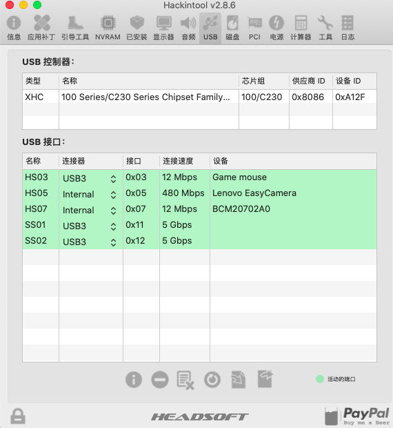

# 联想小新锐 7000 Mojave EFI配置

> 所有配置已经**最精简**，请放心使用！这个是我引以为豪的，哈哈哈

电脑配置：

- 电脑型号: 联想 80WB 笔记本电脑
- 操作系统: Windows 10 64位

-  处理器: 英特尔 Core i5-7300HQ @ 2.50GHz 四核
-    主板: 联想 LNVNB161216
-    内存: 16 GB ( 三星 DDR4 2400MHz / 金士顿 DDR4 2400MHz )-
-  主硬盘: SK HYNIX HFS128GD9MND-5510A ( 128 GB / 固态硬盘 )
-    显卡: Nvidia GeForce GTX 1050 ( 2 GB ) / HD630 集显
-  显示器: 友达 AUO61ED ( 15.5 英寸  )
-    声卡: 瑞昱  @ 英特尔 High Definition Audio 控制器
-    网卡: 博通 Broadcom 802.11ac Network Adapter / 联想

- **内置的无线网卡，被替换成 博通的了**（型号：**BCM94352Z** 淘宝100+买的，笔记本后盖拆开，和插usb一样，直接替换原来的）
- 然后系统是安装在我替换的 sata 接口的 ssd 上

### 功能说明

目前**只发现**HDMI有点问题，其他一律没/未发现问题。 **睡眠、usb、亮度等等一概完美！**

### HIDPI 必须开启！香啊！

用这个大佬的配置，一键开启。我开的是  **1440*810**，真的`香`

> https://github.com/xzhih/one-key-hidpi

### HDMI

目前还没有完美。**但是开启插着开启**，开启后，笔记本黑屏，但是外接显示器是没问题的（我目前测试过家里的电视，还没有单独的外接显示器。。）

### 期待你的完善！让我们一起开心的黑果~

### 上图

