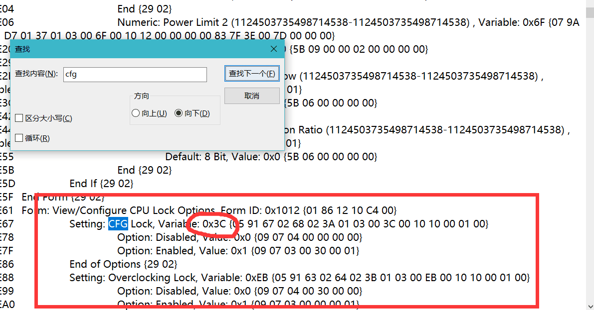
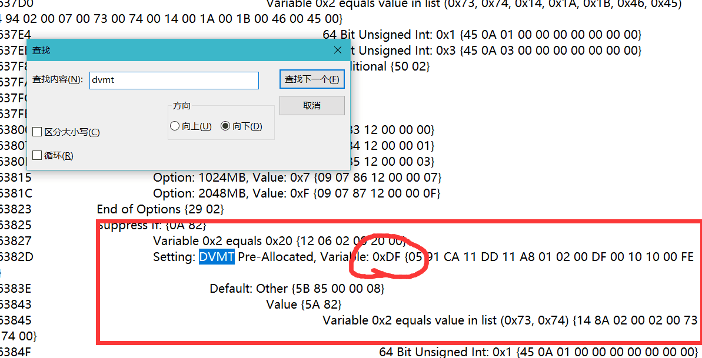
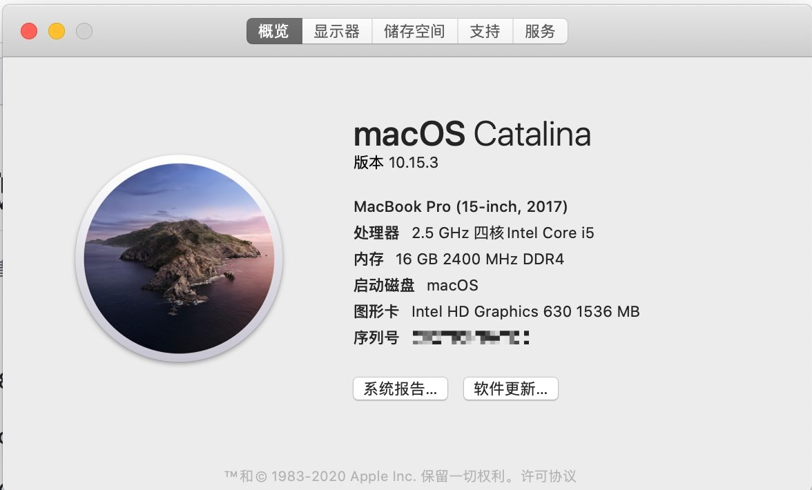
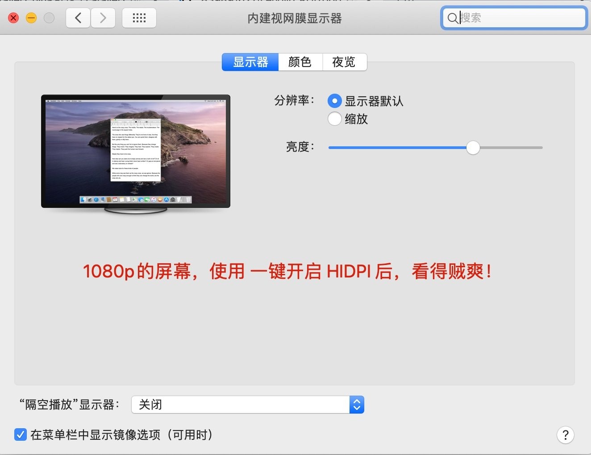
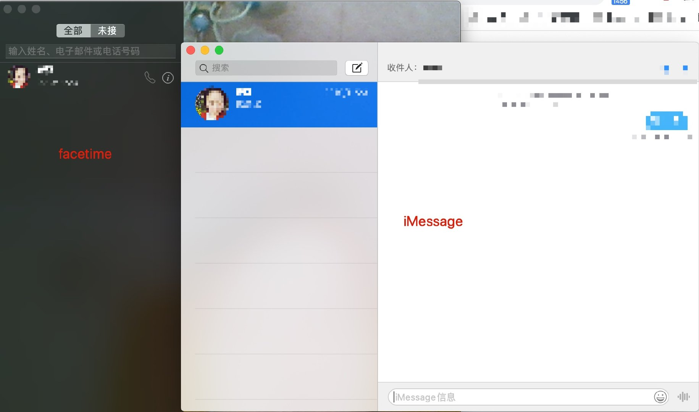
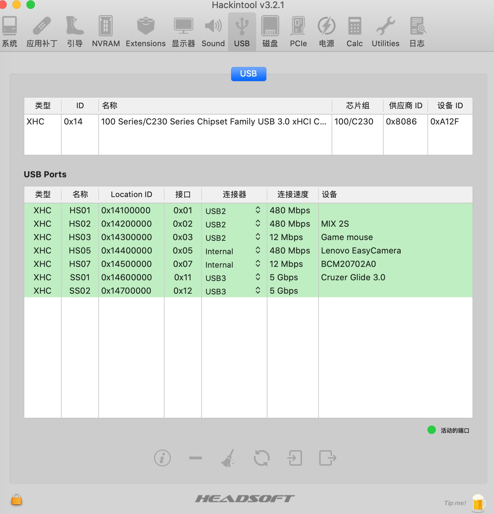

# 联想小新锐 7000 BigSur EFI配置

> 所有配置已经**最精简**，请放心使用！

电脑配置：

- 电脑型号: 联想 80WB 笔记本电脑
- 操作系统: Windows 10 64位
-  处理器: 英特尔 Core i5-7300HQ @ 2.50GHz 四核
-    主板: 联想 LNVNB161216
-    内存: 16 GB ( 三星 DDR4 2400MHz / 金士顿 DDR4 2400MHz )-
-  主硬盘: SK HYNIX HFS128GD9MND-5510A ( 128 GB / 固态硬盘 )
-    显卡: Nvidia GeForce GTX 1050 ( 2 GB ) / HD630 集显
-  显示器: 友达 AUO61ED ( 15.5 英寸  )
-    声卡: 瑞昱  @ 英特尔 High Definition Audio 控制器
- 网卡: 博通 Broadcom 802.11ac Network Adapter / 联想
- **内置的无线网卡，被替换成 博通的了**（型号：**BCM94352Z** 淘宝100+买的，笔记本后盖拆开，和插usb一样，直接替换原来的）
- 然后系统是安装在我替换的 sata 接口的 ssd 上

## 2020.09.01

更新 **OC 6.0** ,安装 **Big Sur**。 

> 目前仓库只更新在用的 OC 配置，clover 已成历史

#### 以下已验证正常：

- 声卡
- 网卡
- 睡眠
- 显卡

#### 以下未验证：

- iMessage 相关
- HDMI 这个以前就没弄好。。 

## 必知

1. 此配置是在  CFG Lock 解锁的情况下配置的，如果你没有解锁，请自行参照其他相关教程调整某些项！！！

> 解锁参考帖子：[联想拯救者Y7000P 2019款bios高级教程——解锁CFG+修改DVMT/其他高级选项](http://bbs.pcbeta.com/forum.php?mod=viewthread&tid=1845189&highlight=y700)

### CFG 和 DVMT 的位置我放这里，省的各位再去找了

目前**只发现**HDMI有点问题，其他一律没/未发现问题。 **睡眠、usb、亮度等等一概完美！**

### HIDPI 必须开启！香啊！

>  

用这个大佬的配置，一键开启。我开的是  **1440*810**，真的`香`

> ~~https://github.com/xzhih/one-key-hidpi~~
>
> **Big sur** 已失效，用这个https://github.com/mlch911/one-key-hidpi 

### 期待你的完善！让我们一起开心的黑果~

### 上图

